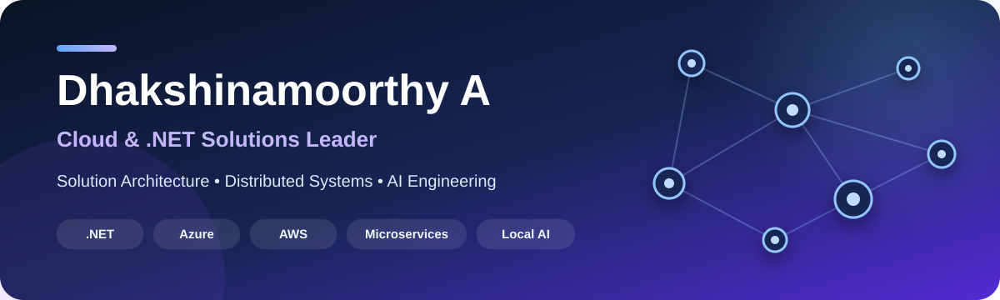

  

  <strong>Designing secure, observable, and maintainable systems—from architecture decisions to working code.</strong>

  
  
  

## Hello, I'm Dhakshinamoorthy

I am a **Cloud and .NET Solutions Leader** based in Chennai, India, with 18+ years of experience across solution architecture, hands-on engineering, and technical delivery.

I turn business requirements into practical system designs and implementation-backed reference projects. My work emphasizes the parts that matter after the first demo: security, failure handling, observability, scalability, maintainability, and clearly documented trade-offs.

- Designing cloud-native and distributed systems with **Microsoft Azure, AWS, and .NET**
- Building **microservices, event-driven workflows, secure APIs, and multi-tenant platforms**
- Exploring **AI-assisted development, local AI, RAG, and provider-neutral orchestration**
- Sharing runnable examples, architecture decisions, and honest production boundaries

## Architecture and engineering focus

| Cloud architecture | Distributed .NET | Security | AI systems |
| --- | --- | --- | --- |
| Azure, AWS, resilience, scalability, cost and trade-offs | Microservices, CQRS, messaging, data consistency and background processing | Identity, JWT, RBAC/ABAC, tenant isolation and secret management | Local AI, RAG, agents, MCP and multi-provider orchestration |

## Featured architecture projects

| Project | Architecture highlights |
| --- | --- |
| **[Solution Architecture Portfolio](https://github.com/adhakshinamoorthy/solution-architecture-portfolio)** | Implementation-backed Azure and AWS reference architectures covering distributed .NET, security, resilience, observability, ADRs, and explicit trade-offs. |
| **[Enterprise Notification Platform](https://github.com/adhakshinamoorthy/Enterprise-Notification-Platform)** | Multi-tenant, event-driven notifications using .NET 10, RabbitMQ, PostgreSQL, Redis, CQRS, Clean Architecture, and OpenTelemetry. |
| **[Event-Driven Order Platform](https://github.com/adhakshinamoorthy/Event-Driven-Order-Platform)** | Microservices, domain-driven design, transactional outbox, RabbitMQ, Redis, SQL Server, and containerized local development. |
| **[Enterprise SaaS Starter Platform](https://github.com/adhakshinamoorthy/Enterprise-SaaS-Starter-Platform)** | Multi-tenancy, BFF and gateway patterns, feature flags, CQRS, messaging, and a React client for an enterprise SaaS foundation. |
| **[Enterprise Observability](https://github.com/adhakshinamoorthy/Enterprise-Observability)** | OpenTelemetry with Prometheus, Grafana, Loki, and Tempo for metrics, structured logs, and distributed traces. |
| **[AI Knowledge Hub](https://github.com/adhakshinamoorthy/AI-Knowledge-Hub)** | Multi-tenant local-first RAG with Ollama, Qdrant, PostgreSQL, RabbitMQ, Redis, semantic search, and observability. |

## Learning projects and reference implementations

| Project | What you can learn |
| --- | --- |
| **[.NET Atlas](https://adhakshinamoorthy.github.io/)** | A responsive learning portal covering the modern .NET ecosystem, architecture practices, code examples, and interview preparation. |
| **[Authentication Demo](https://github.com/adhakshinamoorthy/Authn)** | ASP.NET Core Identity, JWT access and refresh tokens, token rotation, policy-based authorization, Blazor, and focused tests. |
| **[Design Patterns in C#](https://github.com/adhakshinamoorthy/DesignPatterns)** | Runnable examples for all 23 GoF patterns plus repository, dependency injection, CQRS, and practical before-and-after explanations. |
| **[Database Architecture POCs](https://github.com/adhakshinamoorthy/database-architecture-pocs)** | Implementation-backed comparisons of PostgreSQL, MongoDB, Cosmos DB, SQL Server, MySQL, and Supabase. |
| **[Ride Sharing CQRS API](https://github.com/adhakshinamoorthy/RideSharingCqrsApi)** | Separate EF Core write and Dapper read paths, validation, idempotent commands, and a documented API workflow. |
| **[AI GateKeeper](https://github.com/adhakshinamoorthy/AIGateKeeper)** | A .NET and React AI gateway with SSE streaming, rate limiting, PostgreSQL auditing, Docker, and architecture documentation. |

## Technology toolbox

  
  
  
  
  
  
  
  
  
  
  
  
  
  

## How I approach engineering

- **Make decisions visible:** capture context, options, trade-offs, and consequences in architecture decision records.
- **Design for operations:** treat observability, failure handling, security, and deployment as part of the feature.
- **Keep boundaries honest:** distinguish learning projects, production-minded references, and production-ready systems.
- **Prefer runnable evidence:** pair diagrams and explanations with code, tests, containers, and local runbooks.
- **Optimize for maintainers:** use clear abstractions and documentation that help the next engineer make a safe change.

## Let's connect

I enjoy discussing solution architecture, modern .NET, cloud platforms, distributed systems, and practical AI engineering.

- **Portfolio and learning portal:** [.NET Atlas](https://adhakshinamoorthy.github.io/)
- **Professional profile:** [LinkedIn](https://www.linkedin.com/in/adhakshinamoorthy)
- **Source code and architecture projects:** [GitHub repositories](https://github.com/adhakshinamoorthy?tab=repositories)

  Architecture is most useful when its decisions, constraints, and evidence are easy for others to understand.

